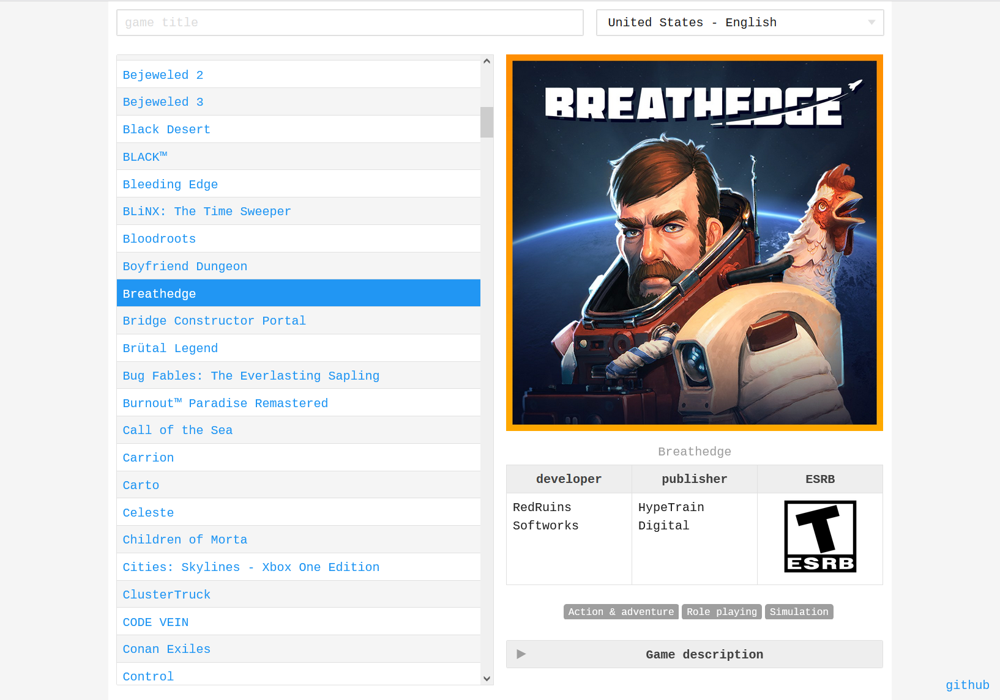

# List of XGP games - website built with React.JS and Flask



## [Live demo](#about)

## Table of Contents

- [About](#about)
- [Getting Started](#getting_started)
- [Usage](#usage)
- [Contributing](../CONTRIBUTING.md)

## About <a name = "about"></a>

This is one of my first projects created in React.JS<br />
I know the code isn't perfect, but at this point I'm happy with it and hopefully I'll be able to improve it over time as I gain more skills. <br />
Game data can be retrieved directly from Microsoft servers from two endpoints:

- the first provides only the game IDs
- the second one (using the POST method) provides data on the given game IDs

I decided to create additional API endpoints (ms API -> my API -> React) for two reasons:

- CORS issues
- the second endpoint from Microsoft provieds a lot of data (not needed for me) so my API filters it and passes to me the ones I need.

Normally I would use Django for this, but I decided to use (for the first time) Flask

Stack: Backend (Flask, Flask-Cors), Fronend (React.js, React-router, tawian css)

## Getting Started <a name = "getting_started"></a>

I will provide you with instructions on how to run this in your local environment.

```
git clone https://github.com/grykom/xbox_game_pass_react_flask.git
cd xbox_game_pass_react_flask
```

### Backend - Flask

To run backend app you will need to install Flask and Flask-Cors (do it on yours python venv):

```
pip install Flask==2.0.2
pip install Flask-Cors==3.0.10
```

then run flask by:

```
xbox_game_pass_react_flask> cd backend
xbox_game_pass_react_flask\backend> flask run
```

It should be running on http://127.0.0.1:5000/ (if not - remember url)

### Frontend - React

Check (or change) backend API_IP in src/App.js, then:

```
xbox_game_pass_react_flask> npm install
xbox_game_pass_react_flask> npm start
```

## Usage <a name = "usage"></a>

Add notes about how to use the system.
